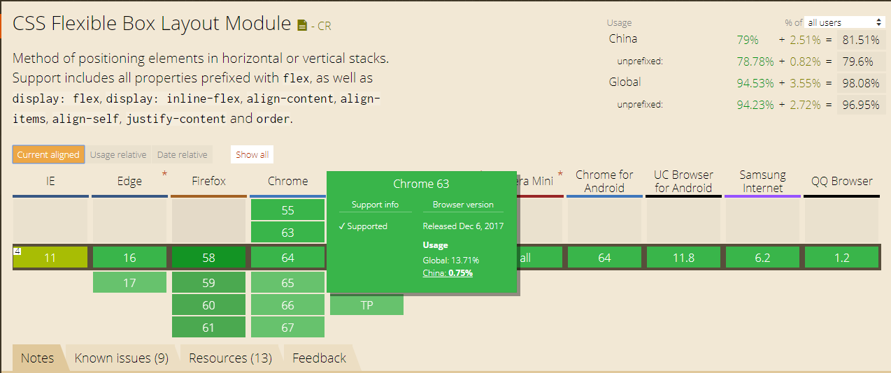

相比传统的布局方式，flex和grid使布局系统简化，轻松的解决了复杂的web布局。
早在以前，所有的HTML布局还是通过table，float以及其他css属性来完成。面对复杂的布局，就没有很好的办法了。

随着flexbox的出现，它专注于创建稳健的响应式页面布局模式，并轻松的正确对齐元素及其内容。如今已是我们的首选。

[Can I Use FlexBox?](https://caniuse.com/#feat=flexbox)

如今flexbox随着浏览器的发展（IE9以下版本渐渐退出舞台），flexbox如火如荼成为了css布局的主流，前端开发者的首选。

与此同时，grid布局在2010年由Microsoft首次提出，目前已成为W3C候选标准，支持grid布局的浏览器也越来越多

[Can I Use Grid?](https://caniuse.com/#feat=css-grid)

